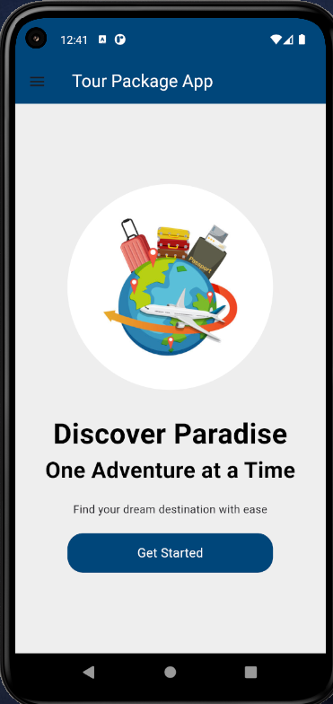
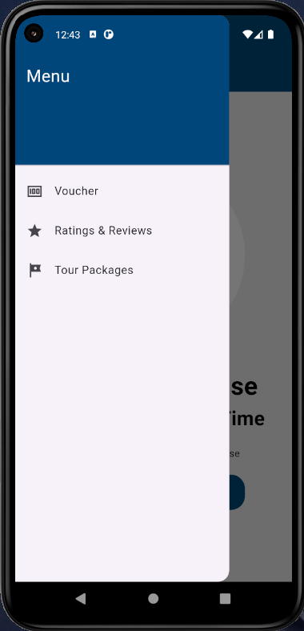
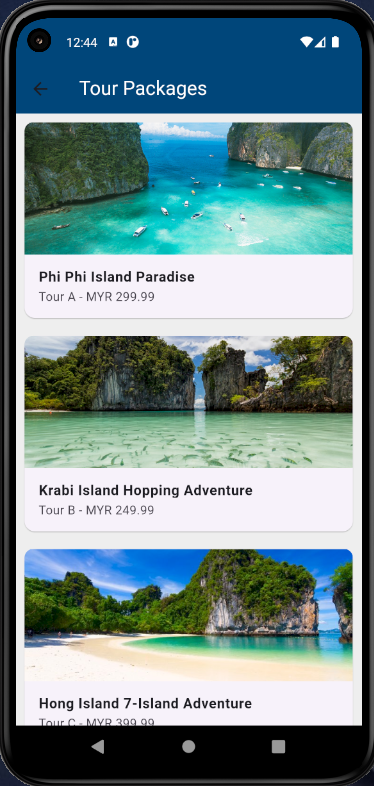
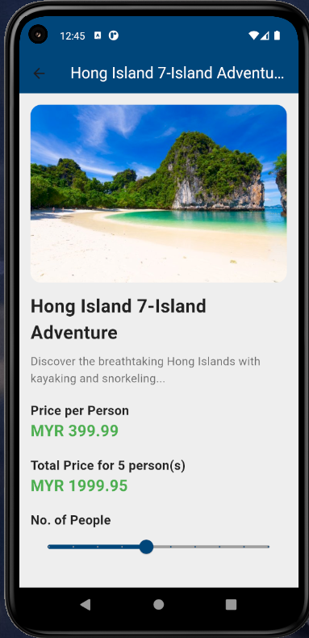
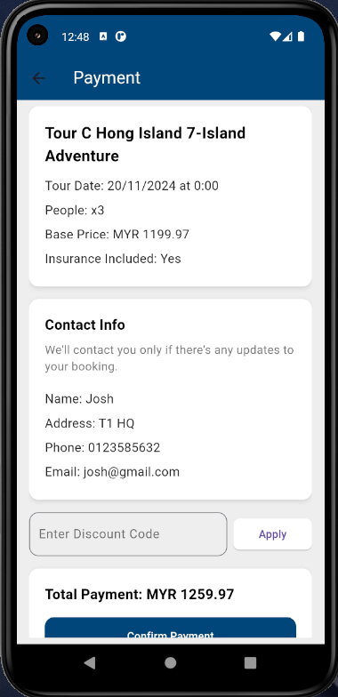
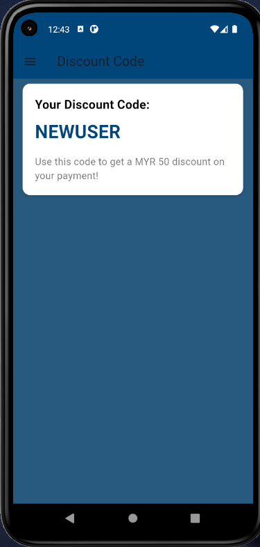
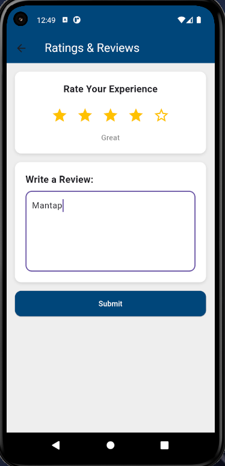

# Tour Package App

A comprehensive mobile application for managing and booking tour packages, built with Flutter. Users can browse available tours, make bookings, and manage their profiles, while administrators can oversee bookings and manage tour packages.

## Features

- **User Authentication**: Secure login and registration for users.
- **Tour Packages**: Browse detailed listings of available tour packages.
- **Booking System**: Users can book tours and manage their bookings.
- **Admin Dashboard**: Specialized dashboard for administrators to manage tours and bookings.
- **User Dashboard**: Personal dashboard for users to view their activity.
- **Profile Management**: Update and maintain user profile information.
- **Responsive Design**: Clean and responsive UI adapted for mobile devices.

## Tech Stack

- **Flutter**: Cross-platform UI toolkit.
- **Dart**: Programming language.
- **SQLite (sqflite)**: Local database for data persistence.
- **Shared Preferences**: For storing simple data like user sessions.
- **Intl**: For date formatting and internationalization.

## Getting Started

### Prerequisites

- [Flutter SDK](https://flutter.dev/docs/get-started/install) installed.
- An IDE (VS Code, Android Studio) with Flutter extensions.

### Installation

1.  **Clone the repository:**
    ```bash
    git clone https://github.com/jaaspring/tour-package-app.git
    ```
2.  **Navigate to the project directory:**
    ```bash
    cd tour-package-app
    ```
3.  **Install dependencies:**
    ```bash
    flutter pub get
    ```
4.  **Run the app:**
    ```bash
    flutter run
    ```

## Project Structure

- `lib/screens/`: Contains all the UI screens (Login, Registration, Dashboards, etc.).
- `lib/main.dart`: Entry point of the application including routing configuration.

## Contributing

Contributions are welcome! Please fork the repository and submit a pull request for any improvements or bug fixes.
## Screenshots

Below are some screenshots of the application showcasing its main features:

| | | |
|:---:|:---:|:---:|
| **Dashboard** <br><br>  | **Menu & Navigation** <br><br>  | **Tour Packages** <br><br>  |
| | | |
| **Package Details** <br><br>  | **Book a Tour** <br><br>  | **Payment Screen** <br><br>  |
| | | |
| **Coupons & Discounts** <br><br>  | **Rate & Reviews** <br><br>  | |
